# Athena Hack - Cisco Webex Lab Guide

### Getting started

These instructions will take you through the different tools and platforms used in this lab and provide you with a basic introduction to using the Cisco Webex Teams API and low code environment Built.io. With the aim of building a simple ChatBot. After completing this guide you may want to include Webex Teams in your own projects, if you do please reach out to one of our team onsite to let them know and see how we can support!

### Prerequisites

* A [Cisco Webex](https://www.webex.com)

* A [Built.io](http://built.io) account

* A [Giphy](http://giphy.com) account

* Download Webex Teams Desktop https://www.webex.com/team-collaboration.html

### Registering for Cisco Webex Teams

During this lab we will use the Cisco Webex Teams API to both send and receive messages for the ChatBot we are going to build. To do that the first thing we do is register for a free Webex Teams account which we can do by following the link below.

http://cs.co/RegisterForTeams

### Install the Webex Teams client

Once we're registered you may want to test out Webex Teams by sending and receiving a few messages, also during the lab we'll need to send some messages to our bot we're going to create. To do this we need to have a client. To download the client, follow to the link: https://www.webex.com/downloads.html and click the download button for the Webex Teams client.

Alternatively you can use the web browser client which can be found at: https://teams.webex.com

### Creating our Bot in Webex Teams and getting an access token

Now we have our Teams account, we have access to developer site for Webex Teams: https://developer.webex.com. This portal has guides to the Teams API, SDK's available and example projects to help you on your developer journey. We won't go into the details of this site in this lab but we do need to create our bot and get an access token/

To do this navigate to the 'My Apps' page of your account https://developer.webex.com/my-apps select 'Create New App' and when prompted choose the Bot type then complete by filling in the Bot Name / Username, selecting an Icon and giving it a short description. Once submitted, you will then be given an access token. Save this as we will use it later in the Built.io steps.

### Creating a Webex Teams Room
In this section you will download the Webex Teams desktop client, create a new space and add your bot to the space.

1. If you have not already done so, Go to [Cisco Webex](https://www.webex.com) homepage and select "Team Collaboration". This will take you to the Teams download page.

2. Select "Download Teams" and install.

3. Once teams is installed create a new teams space
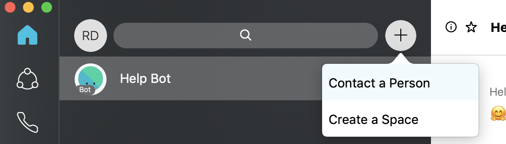

3. Give your new space a name *(optionally you can add your bot name at this stage or we can do it later)*
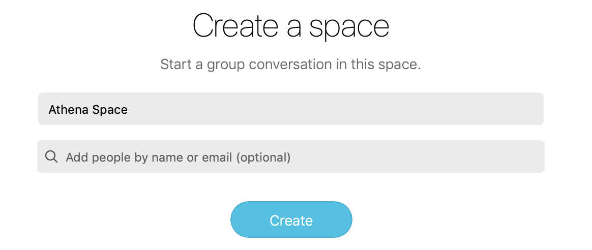

4. If you have not already added your bot do it now by selecting clicking dotted circle top right and selecting "Add People"
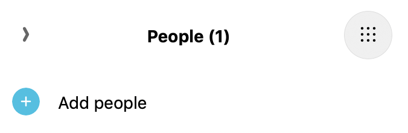

5. Type the name of the Bot you created.
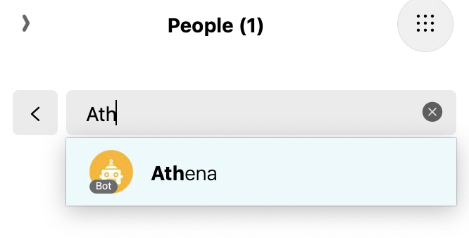

COOL! Now you have a teams space and a bot. We now need to teach it how to talk and do stuff.

##Creating a Built.io Workflow for your Bot##

In this section we will build a workflow in built.io that will instruct our bot to perform some functions.
We will use a standard Webex Teams workflow template

If you have not already done so, log in or sign up [Built.io](http://built.io) and [Giphy](http://giphy.com) account

1. Once you have logged in to built.io you will see this default screen
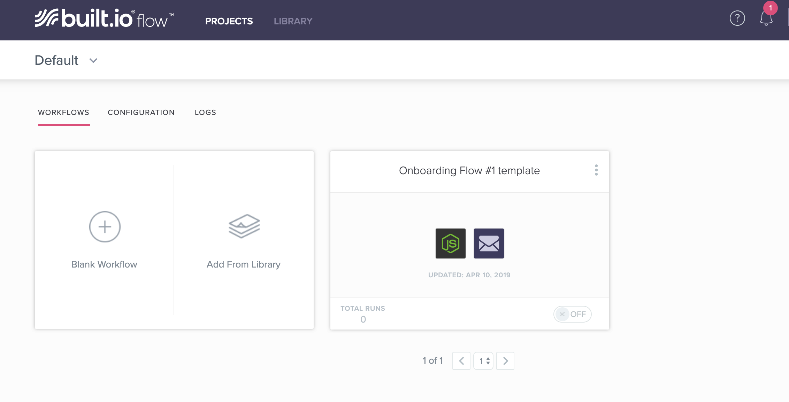

2. select "Library" and you will see a list of pre-defined workflows. We want to select the "Webex Teams BOT" workflow

3. The Webex Teams Bot workflow will be added to your default project
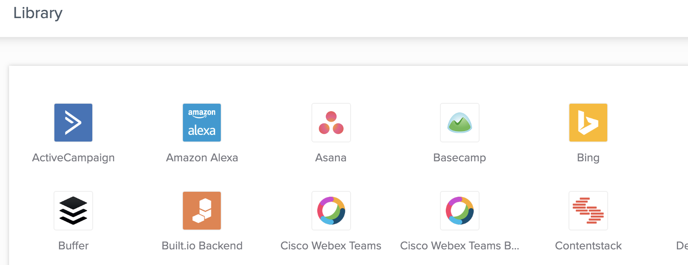

4. Select the worflow and then click it to open the dialogue
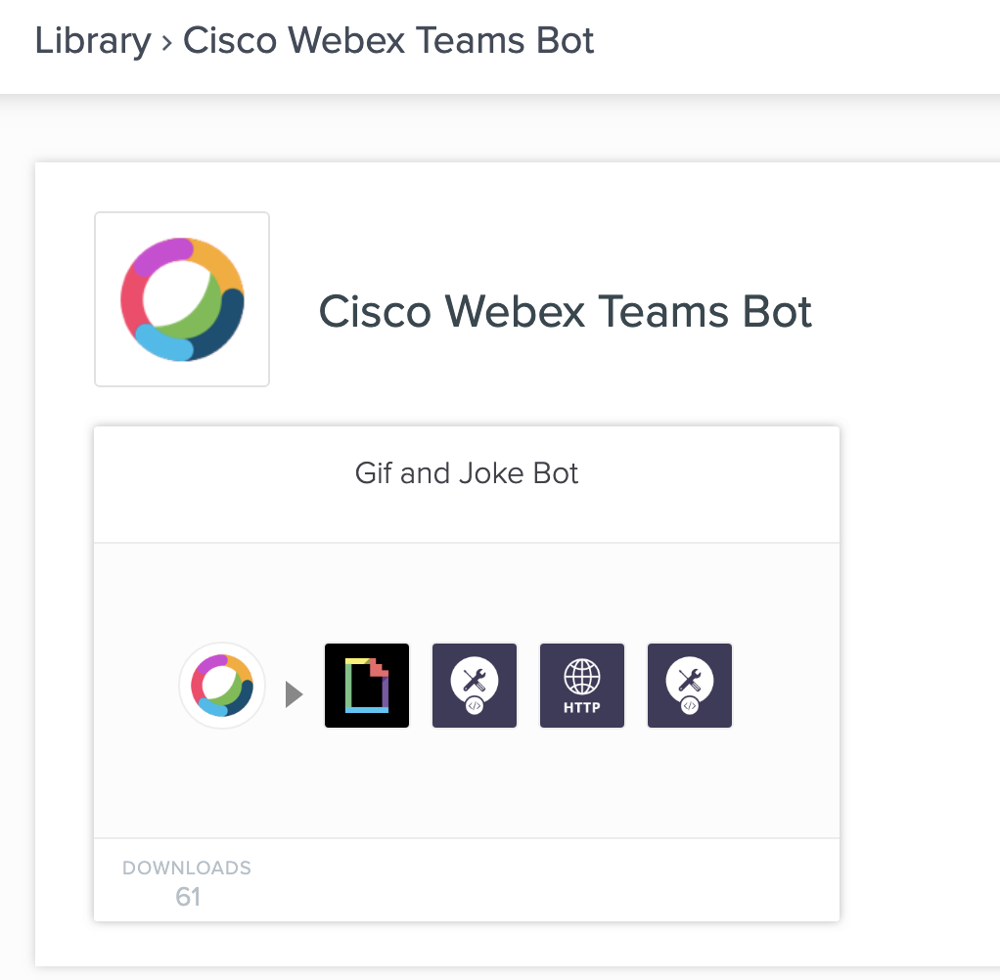
Now we start to populate the workflow with the Webex Teams information generated in the previous steps

5. From the dialoge box select "Connect to Cisco Webex Teams Bot"

6. Give the Bot a name and insert the Bot Token you recored in the prevous Bot creation steps
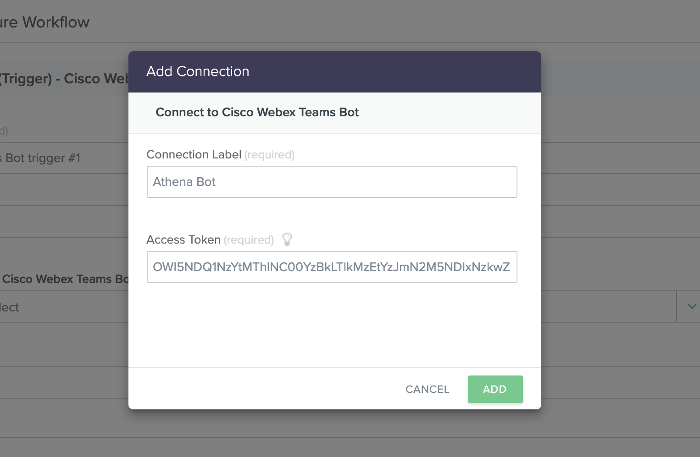

7.Now we need to add our space ID. To do this we need to go back to [deveoper.webex.com](https://https://developer.webex.com) and select documentation. We are looking for API REFERENCE and Rooms. [Shortcut here](https://developer.webex.com/docs/api/v1/rooms)

8.Once you are in the rooms API documentation you will find the Rooms API Calls. Select "LIST ROOMS"
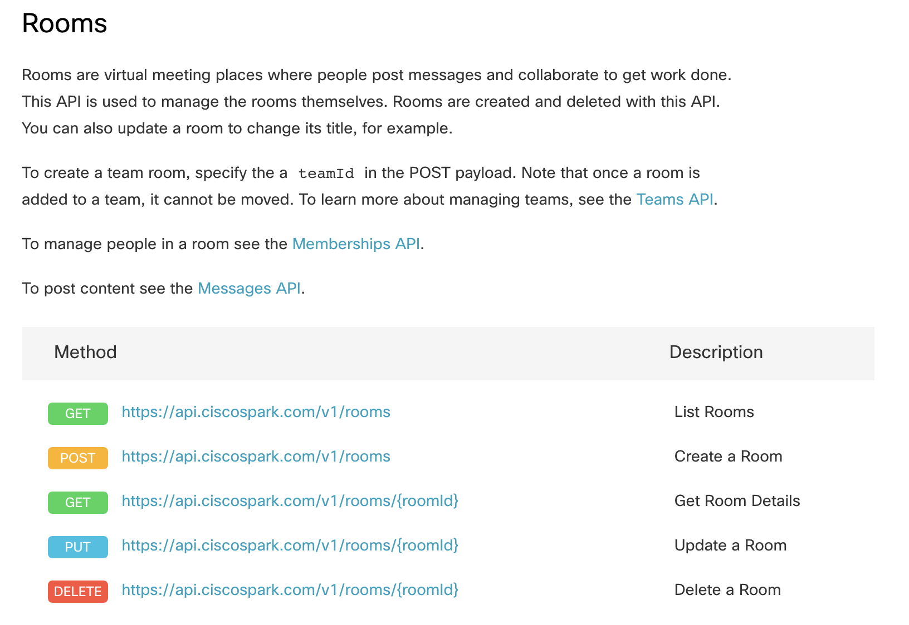

9.The API form is populated for you. Jsut press "Run"
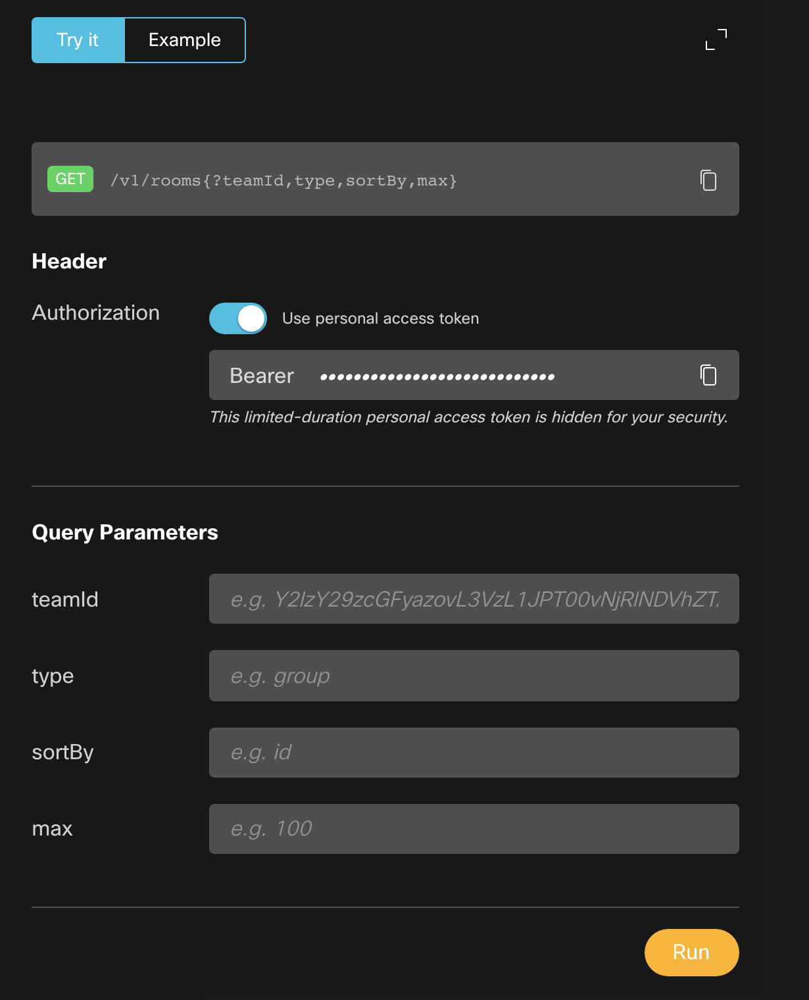

10.The API request will be made and the Response will list all rooms assocaited with your webex account.
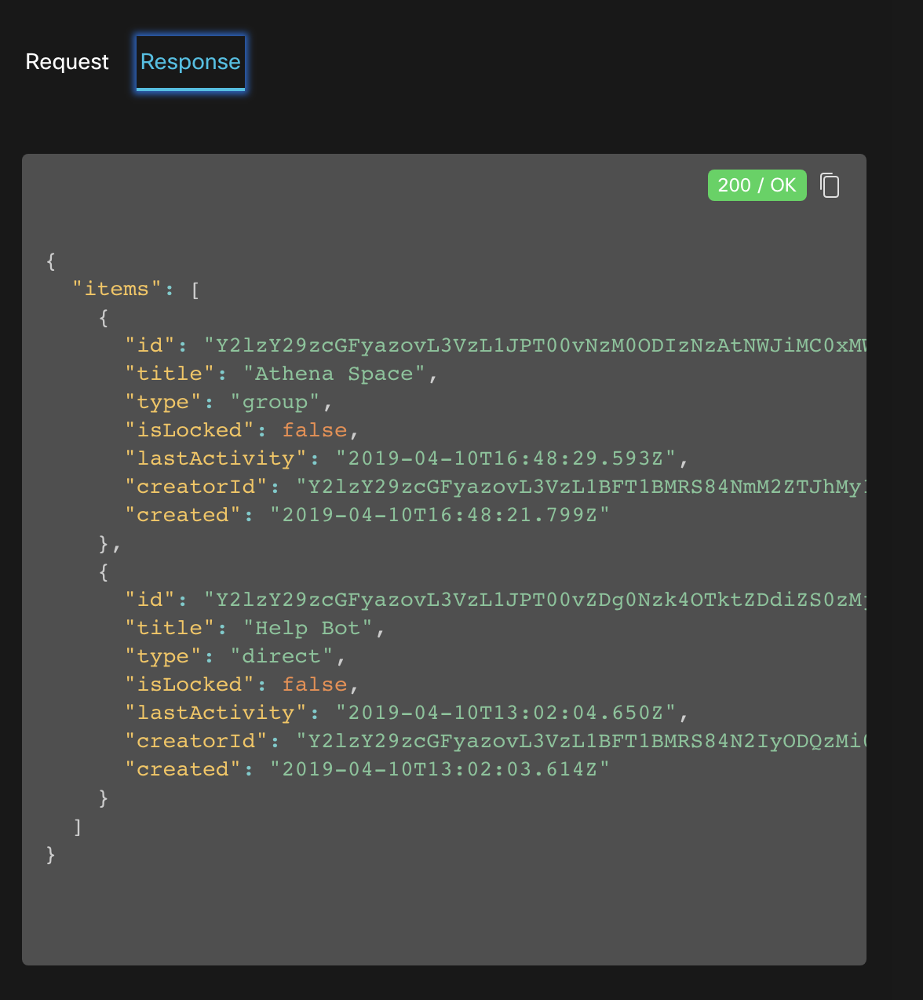
Find the room ID associated with the space you created earlier. (In the example above its the first room. Copy the "ID" from the response. For exmaple "Y2lzY29zcGFyazovL3VzL1JPT00vNzM0ODIzNzAtNWJiMC0xMWU5LTgzY2QtMGQ1YWM4YWM2OGMx"
Remember to remove the quotes)

11.Go back to built.io and Add the Room ID to you built.io workflow
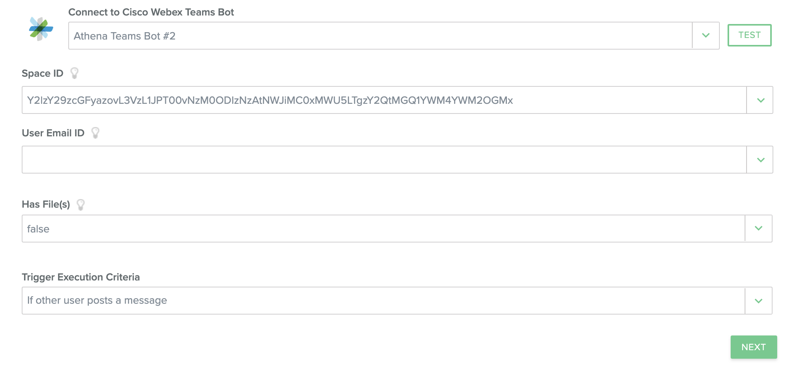
Leave "User Email ID" blank and in the "Has File(s) box select "FALSE" from the drop down.
Leave Trigger Execution as default "if other user posts a message"

12.Now you will need your Giphy API. You get this by logging into [deveopers.giphy.com](https://https://developers.giphy.com) with your Giphy credentials you created earlier. If you didn't create a Gihpy account now.

13.Click the "Create an App" button

 and give you app an name and description select "Create New App"

14.You will now be presented with your very own Giphy API Key *(Make a copy of this)*
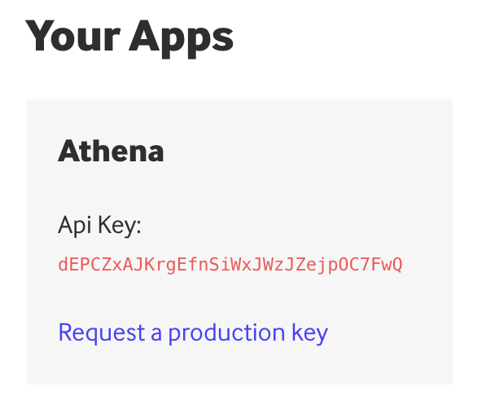

15.Now back to built.io and select a new Giphy Connection
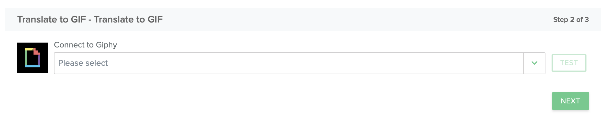

16.Add the Key

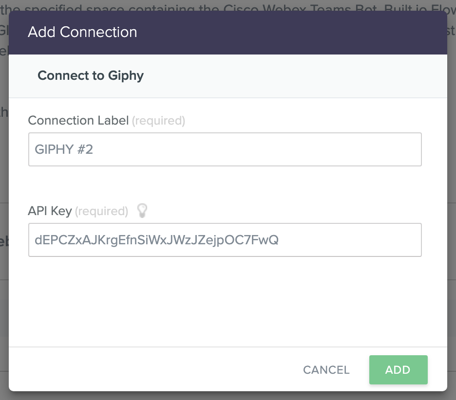

17.Reenter your Webex Bot and Room ID
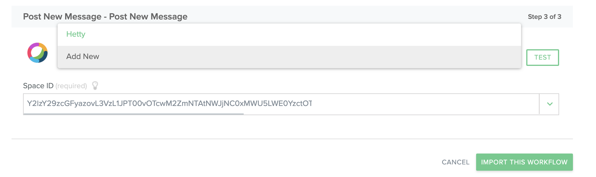, click "Import This Workflow"

18. Lastly, check you workflow is SAVED and ON
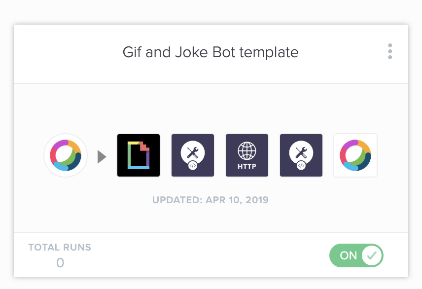

##Testing it All Works##

1. Go to your webex Team desktop and into the space you created earlier with the Bot in it. Say "hello" to your Bot (remember to address the bot directly with an "@")

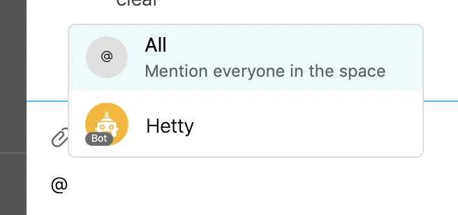

and....drop the mic! You have a working chatbot with integrations.
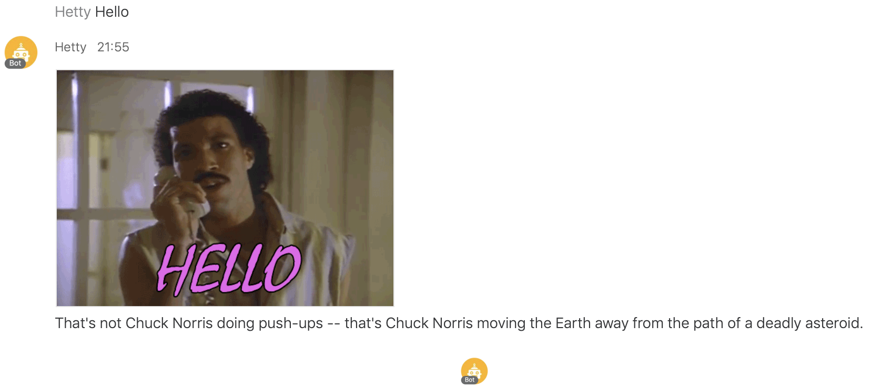

2.
