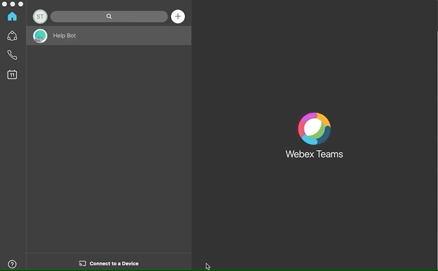
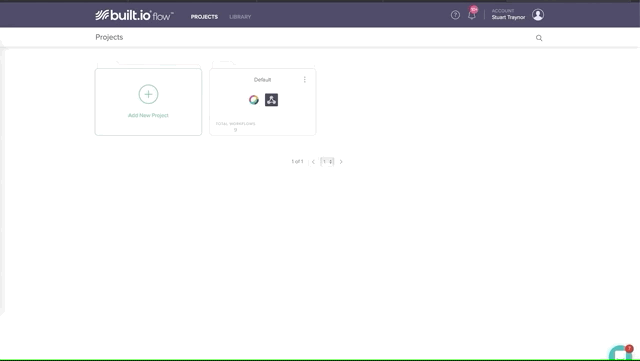

# Athena Hack ChatBot - Cisco Webex Lab Guide

## Getting Started

These instructions will take you through the different tools and platforms used in this lab and provide you with a basic introduction to using the Cisco Webex Teams API and low code environment Built.io. With the aim of building a simple ChatBot. After completing this guide you may want to include Webex Teams in your own projects, if you do please reach out to one of our team onsite to let them know and see how we can support!

__to summarise. In this lab you will__
1. Create a Chatbot _(webex Teams Devepoper Portal)_
2. Create a Teams Space _(Webex Teams Desktop)_
3. Create a built.io worklfow to control your Chatbot _(Built.io)_

You will need:
* A webex Teams Account..
* A Webex Teams Desktop or Browswer Client..
* A Built.io account..
* A Giphy Account..

Ok. Lets get going....

### Registering for Cisco Webex Teams

During this lab we will use the Cisco Webex Teams API to both send and receive messages for the ChatBot we are going to build. To do that the first thing we do is register for a free Webex Teams account which we can do by following the link below.

http://cs.co/RegisterForTeams

### Install the Webex Teams client

Once we're registered you may want to test out Webex Teams by sending and receiving a few messages, also during the lab we'll need to send some messages to our bot we're going to create. To do this we need to have a client. To download the client, follow to the link: https://www.webex.com/downloads.html and click the download button for the Webex Teams client.

Alternatively you can use the web browser client which can be found at: https://teams.webex.com

### Other Prerequisites

You will also need the following accounts for this lab. Make sure you create them before starting.

* A [Built.io](http://built.io) account

* A [Giphy](http://giphy.com) account

## Creating our Bot in Webex Teams and getting our access token

Now we have our Teams account we have access to developer site for Webex Teams: https://developer.webex.com. This portal has guides to the Teams API, SDK's available and example projects to help you on your developer journey. We won't go into the details of this site in this lab but we do need to create our bot and get an access token/

To do this navigate to the 'My Apps' page of your account https://developer.webex.com/my-apps select 'Create New App' and when prompted choose the Bot type then complete the form which asks for Username / Bot Name, Bot Icon and a short discription. Once submitted, you will then be given an access token. ***Save this as we will use it later in the Built.io steps.***

### Creating a Webex Teams Room
In this section you will create a new Webex Teams space and add your bot to the space.

1. If you have not already done so, install Webex Teams Client. If you have already, go to step 2. 

...(Go to [Cisco Webex](https://www.webex.com) homepage and select "Team Collaboration". This will take you to the Teams  download page. Go back to the "Install the Webex Teams client" section if you've missed that step).

 
2. Once teams is installed create a new teams space by pressing the "+" sign on the client

3. Give your new space a name *(optionally you can add your bot name at this stage or we can do it later)*

4. If you have not already added your bot do it now by clicking the dotted button top right and selecting people then use the option to "add people"

5. Type the name of the Bot you created.

COOL! Now you have a teams space and a bot, but it's not very interesting yet. We now need to teach it how to talk and do stuff.

## Creating a Built.io Workflow for your Bot

Now its time to start to give our bot some intelligence. In this section we will build a workflow in built.io that will instruct our bot to perform some functions.

We will use a standard Webex Teams workflow template

If you have not already done so, log in or sign up [Built.io](http://built.io) and [Giphy](http://giphy.com) account

#### Steps 1 - 4 Accessing the prebuilt Bot Library

1. Once you have logged in to built.io you will see the default screen where your projects will sit, right now we have a default project with an "Onboarding Flow#1 template" Ignore this. Nothing to see here. Lets move to step 2.

2. select "Library" and you will see a list of pre-defined workflows. We want to select the "Webex Teams BOT" workflow ***There are two so make sure you pick the one that mentions BOT in the title (It's normally on the right hand side)***

3. The Webex Teams Bot workflow will be added to your default project

4. Select the worflow and then click it to open the dialogue

Now we start to populate the workflow with the Webex Teams information generated in the previous steps

#### Steps 5 - 6 Adding the Bot Access Token

5. From the dialoge box select "Connect to Cisco Webex Teams Bot"

6. Give the Bot a name and insert the Bot Token you recored in the prevous Bot creation steps _(you saved/copied it earlier remember, when you created the bot!)_  :-)

#### Steps 7 - 12 Adding the RoomID

7.Now we need to add our Webex Teams space ID. To do this we need to go back to [developer.webex.com](https://developer.webex.com) and select documentation. We are looking for API REFERENCE and Rooms. [Shortcut here](https://developer.webex.com/docs/api/v1/rooms)

8.Once you are in the rooms API documentation you will find the Rooms API Calls. Select "LIST ROOMS"

9.The API form is populated for you. Just press "Run"

10.The API request will be made and the Response will list all rooms assocaited with your webex account.

Find the room ID associated with the space you created earlier. (Like in the example above it's normally the first room. Copy the "id" from the response. For exmaple "Y2lzY29zcGFyazovL3VzL1JPT00vNzM0ODIzNzAtNWJiMC0xMWU5LTgzY2QtMGQ1YWM4YWM2OGMx"
Remember to remove the quotes)

11.Go back to built.io and Add the Room ID to you built.io workflow

Leave "User Email ID" blank and in the "Has File(s) box select "FALSE" from the drop down.
Leave Trigger Execution as default "if other user posts a message"

You are doing great. We are almost there!

#### Steps 12 - 14 Getting our GIPHY API Key

12.Now you will need your Giphy API. You get this by logging into [developers.giphy.com](https://developers.giphy.com) with your Giphy credentials you created earlier. If you didn't create a Giphy account now.

13.Click the "Create an App" button and give your app an name and description select "Create New App"

14.You will now be presented with your very own Giphy API Key *(Make a copy of this)*

#### Steps 15 - 16 Adding our GIPHY API Key and finishing up

15.Now lets go back to built.io and press next on our form to proceed selecting a new Giphy Connection

16.Add the Key you got in the previous step and press next, Built.IO will ask you to confirm the Bot you wish to use one more time and the RoomID. Confirm these and finish up by 'importing this workflow' This moves the bot you've jsut created into your own projects space.

#### Importing and enabling the flow

17. Check the Bot has imported correctly by going to your projects and making sure its there. Lastly, check you workflow is set to ON.

## Testing it All Works

1. Go to your webex Team desktop and into the space you created earlier with the Bot in it. Say "hello" to your Bot (remember to address the bot directly with an "@")

and....drop the mic! You have a working chatbot with integrations.

## Have a Play
Feel free to spend a bit of time understanding the details of this simple built.io workflow. Looks how the splicing is acheived before we call the Giphy API. Click a connecter and see that you can add a conditional to the trigger. Change what you bot is saying. Why not add some more elements to the workflow, i dunno.. send a tweet. 

If you are really keen, now you understand the basics of teams, you can scrap built.io and code directly against the Webex Teams API yourself. All you need is on the developer.webex.com pages. 

## Further resources

Webex is just one of the platforms you have available to you, now you have a Webex Teams account you can use this to access the rest of our Cisco Developer Network and the wealth of tools available. This includes API documentation, walkthroughs and Sandboxes that allow you to get hands on with your code. The Cisco DevNet portal covers numerous technologies including AI/ML, collaboration, IoT and more! To access all this completely free content just follow the link below. and login with one of the options presented. Feel free to use the Webex Teams account that you created earlier!

https://developer.cisco.com/join/athenahack19

and if you have any questions, please reach out to our fantastic team onsite!

## Advanced BuiltIO Workflows
The free account on built.io is limited to two triggers. Remember you can create two workflows with a trigger in each to determine your chatbot behaviours. We did that with our Plastic reporting teams space. 
 

